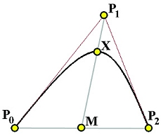
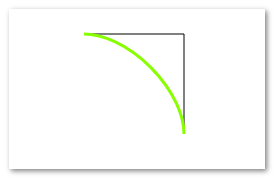

ConicCurveTo
=========
**Status**: explainer.

Draw curves based on conic sections. These are useful as they can represent
circular, elliptical and hyperbolic paths whereas bezier 
curves are limited to quadratic arcs.

Proposal
--------

```webidl
interface mixin Canvas {
  // all doubles are unrestricted.
  void conicCurveTo(double cpx, double cpy, double x, double y, double weight);
};
```
This is a similar interface to [`bezierCurveTo`](https://developer.mozilla.org/en-US/docs/Web/API/CanvasRenderingContext2D/bezierCurveTo). `conicCurveTo` defines a curve from the starting point (_P0_) to
destination point (_P2_) that bends towards control point (_P1_) as weighted by
`weight`:



Fig 1 - Points on a conic curve [Source](http://www.cs.mtu.edu/~shene/COURSES/cs3621/NOTES/spline/NURBS/RB-conics.html)

 - `x`, `y` are the coordinates of _P2_.
 - `cpx`, `cpy` are the coordinates of _P1_.
 - `weight` defines how much the line bends towards _P1_:
   - `weight = 0` defines a straight line from the _P0_ to _P2_.
   - `weight = 1` defines a quadratic path.
   - `weight < 1` is elliptical, while `weight > 1` is hyperbolic.
   - `weight = infinity` essentially makes two line segments _P0P1_ and _P1P2_.
   
If _P0_, _P1_ and _P2_ are all the corners of a square, then `weight = sqrt(2)/2` defines a circular arc. This can be used for rounded corners.

The mathematical derivation of these quantities can be found [here](http://www.cs.mtu.edu/~shene/COURSES/cs3621/NOTES/spline/NURBS/RB-conics.html).

### Open issues and questions

- How much demand is there for this among developers
- This is already implemented by Skia, but are there performance implications?

Example usage
-------------

```js
// Javascript example
const canvas = document.createElement('canvas');
const ctx = canvas.getContext('2d');

ctx.beginPath();
ctx.moveTo(100, 100); // Starting Point is (100, 100)
// Control Point is (200, 100)
// End Point is (200, 200)
// Weight is 1
ctx.conicCurveTo(200, 100, 200, 200, 1);
ctx.stroke();

```

The above code will produce the following curve, shown in green.
Lines _pc_ and _cd_ are shown in black:



References
----------

 - Skia: [SkPath.conicTo](https://skia.org/user/api/SkPath_Reference#SkPath_conicTo)
 - [Conic Sections](https://en.wikipedia.org/wiki/Conic_section)
 - [Mathematical derivation from NURBS](http://www.cs.mtu.edu/~shene/COURSES/cs3621/NOTES/spline/NURBS/RB-conics.html)
