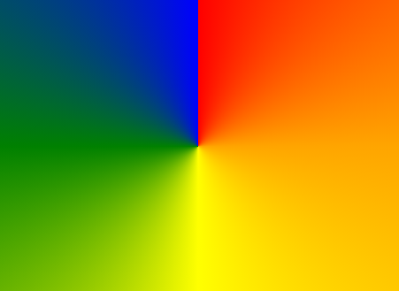

Conic gradient
==============
**Status**: explainer.

Adds conic gradients.

This is equivalent to CSS's `conic-gradient()` function.


Proposal
--------

```webidl
interface mixin CanvasFillStrokeStyles {
  // addition:
  CanvasGradient createConicGradient(unrestricted double startAngle, unrestricted double cx, unrestricted double cy);
};
```

When using conic gradients `CanvasGradient` stops are normalized from 0 to 1 (as opposed to using radians). This is consistent with other gradients that use normalized values.


Example usage
-------------

```js
// Javascript example
const canvas = document.createElement('canvas');
const ctx = canvas.getContext('2d');

const grad = ctx.createConicGradient(0, 100, 100);

grad.addColorStop(0, "red");
grad.addColorStop(0.25, "orange");
grad.addColorStop(0.5, "yellow");
grad.addColorStop(0.75, "green");
grad.addColorStop(1, "blue");

ctx.fillStyle = grad;
ctx.fillRect(0, 0, 200, 200);
document.body.append(canvas);
```

Will result in image:




Alternatives considered
-----------------------

none.

References
----------

- https://developer.mozilla.org/en-US/docs/Web/CSS/conic-gradient
