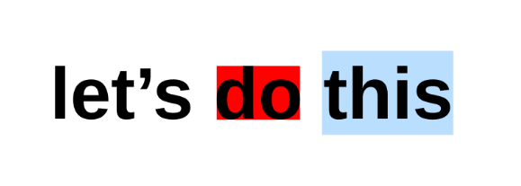

# Enhanced TextMetrics for Selection and Bounding Box

**Status**: explainer.

## Goals

Extend the capabilities of `TextMetrics` to support selection rectangles and bounding box queries over character ranges. This would additionally enable precise caret positioning.

## Rationale

Users should be able to interact with canvas-based text input (like Google Docs, VSCode, Miro) that correctly renders selection and caret positions.

All metrics available through DOM APIs should also be available on `measureText()`. Furthermore, `measureText()` will always be limited to a single style, and therefore has the potential to be much faster (as it doesn’t need layout). `measureText()` must return the same value as the equivalent DOM APIs.

## Proposal

```webidl
[Exposed=(Window,Worker)] interface TextMetrics {
  // ... extended from current TextMetrics.
  
  sequence<DOMRectReadOnly> getSelectionRects(unsigned long start, unsigned long end);
  DOMRectReadOnly getActualBoundingBox(unsigned long start, unsigned long end);

  unsigned long caretPositionFromOffset(double offset);
};
```

Both functions operate in character ranges and return bounding boxes relative to the text’s origin (i.e., `textBaseline`/`textAlign` is taken into account).

`getSelectionRects()` returns the set of rectangles that the UA would render as selection to select a particular character range.

`getActualBoundingBox()` returns an equivalent box to `TextMetrics.actualBoundingBox`, i.e., the bounding rectangle for the drawing of that range. Notice that this can be (and usually is) different from the selection rect, as those are about the flow and advance of the text. A font that is particularly slanted or whose accents go beyond the flow of text will have a different paint bounding box. For example: if you select this: ***W*** you will see that the end of the W is outside the selection area, which would be covered by the paint (actual bounding box) area.

## Example usage

```js
const canvas = document.querySelector("canvas");
const ctx = canvas.getContext("2d");

const textMetrics = ctx.measureText("let's do this");
ctx.fillStyle = "red";
const boxForSecondWord = textMetrics.getActualBoundingBox(6, 8);
ctx.fillRect(
    boxForSecondWord.x,
    boxForSecondWord.y,
    boxForSecondWord.width,
    boxForSecondWord.height,
);
const selectionForThirdWord = textMetrics.getSelectionRects(9, 13);
ctx.fillStyle = "lightblue";
for (const s of selectionForThirdWord) {
    ctx.fillRect(s.x, s.y, s.width, s.height);
}
ctx.fillStyle = "black";
ctx.fillText("let's do this");
```

`getSelectionRects()` can be used on Chrome Canary (starting from version `127.0.6483.0`) by using enabling the feature with `--enable-features=ExtendedTextMetrics` (or the general `--enable-experimental-web-platform-features`).

Expected output:



## Alternatives and Open Questions

