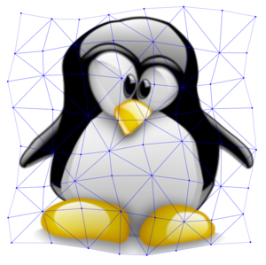
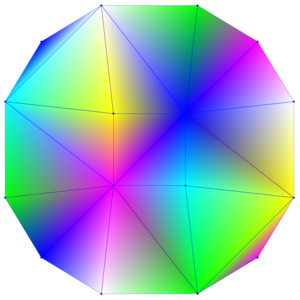
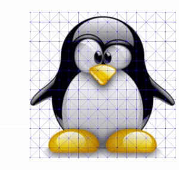

# Mesh2D

**Status**: explainer

## Goals
Provide a simple and high-performance canvas 2D triangle mesh API that can be used to batch-render a large number of textured triangles.

Offer full control of the mesh geometry and texture mapping, to support complex effects that require an intentional mesh design (custom topology, variable density, ordering, etc) -- as opposed to auto-generating the mesh.

## Rationale
Triangle meshes are a basic building block of most low-level graphics APIs, and their rendering is heavily optimized on modern hardware.  They can represent complex geometries, and provide an efficient mechanism for texture mapping and morphing.

Mapping textures to arbitrary geometries is of great importance to animation engines (e.g. Lottie, Rive), both as a direct animation mechanism and as an utility for implementing various morphological effects.  Since Canvas2D does not currently support drawing triangle meshes, such animation engines are either resorting to inefficient workarounds or limiting the set of supported features on the web.

## Use cases

### 2D texture mapping
Mapping textures to complex 2D shapes is a useful technique for implementing various distortion effects (stretch/compress, fish eye, etc).



### 2D shape animations
Currently, shapes can be animated as 2D paths - which offer great geometric accuracy, but very few fill options (solid color, gradients, patterns).

Meshes enable natural animation of heavily textured shapes, as they seamlessly translate the geometric transformation to texture space.


### Color/gradient meshes
Instead of sampling from a texture, meshes can also use color information assigned to each vertex to generate 2D multi-point gradients.



### 3D effect simulation
While a 2D mesh does not offer native support for 3D transformations, it does simplify the emulation of such effects by separating the vertex geometry from texture mapping concerns.

Clients can easily create 3D-like effects by manipulating a small number (relative to the shape and texture size) of vertices, and then passing them to the 2D drawing API.




## Proposal
### Mesh2D API
Mesh2D is a collection of APIs for drawing 2D meshes and managing mesh-related data.

At a high level, drawing a triangle mesh requires

 - a **mesh geometry** (vertex positions and triangle topology)
 - a **texture source** (images, gradients, colors, patterns, etc)
 - vertex -> texture **mapping information** (per-vertex uv coordinates or per-vertex colors)


```webidl
// Describes the mesh geometry (vertex positions), and can be constructed
// from a float32 typed array (two floats per vertex).
[ Exposed=(Window,Worker,PaintWorklet) ] interface Mesh2DVertexBuffer {};

// Describes the mapping of vertices to UV coordinates.  Similar format and
// factory to Mesh2DVertexBuffer.
[ Exposed=(Window,Worker,PaintWorklet) ] interface Mesh2DUVBuffer {};

// Describes the mapping of vertices to colors (one RGBA color per vertex).
// Can be constructed from a uint8 typed array (four uints per color).
[ Exposed=(Window,Worker,PaintWorklet) ] interface Mesh2DColorBuffer {};

// Describes the mesh topology (triangle grouping), as an array of vertex indices,
// three indices per triangle.  Can be constructed from an uint16 type array.
// (n.b. these are vertex indices, not float32 indices, in the vertex array)
[ Exposed=(Window,Worker,PaintWorklet) ] interface Mesh2DIndexBuffer {};

typedef (CanvasImageSource or
         CanvasGradient or
         CanvasPattern) MeshTextureSource;

interface CanvasRenderingContext2D {
    // Mesh buffer factories.
    [RaisesException] Mesh2DVertexBuffer createMesh2DVertexBuffer(Float32Array buffer);
    [RaisesException] Mesh2DUVBuffer createMesh2DUVBuffer(Float32Array buffer);
    [RaisesException] Mesh2DColorBuffer createMesh2DColorBuffer(Uint8ClampedArray buffer);
    [RaisesException] Mesh2DIndexBuffer createMesh2DIndexBuffer(Uint16Array buffer);

    // Triangle mesh using a texture source and UV mapping.
    [HighEntropy, RaisesException] void drawMesh(Mesh2DVertexBuffer vertex_buffer,
                                                 Mesh2DUVBuffer uv_buffer,
                                                 Mesh2DIndexBuffer index_buffer,
                                                 MeshTextureSource texture_source);

    // Triangle mesh using explicit vertex colors.
    [HighEntropy, RaisesException] void drawMesh(Mesh2DVertexBuffer vertex_buffer,
                                                 Mesh2DColorBuffer color_buffer,
                                                 Mesh2DIndexBuffer index_buffer);
};
```

## Example usage
### Allocating mesh buffers
```js
const ctx = document.getElementById("canvas").getContext("2d");

// A trivial 4-vertex, 2-triangle mesh:
// 0    1
//  *--*
//  |\ |
//  | \|
//  *--*
// 3    2

// Vertex position buffer: Float32Array, two float32s per vertex.
const vbuf = ctx.createMesh2DVertexBuffer(new Float32Array([
    0,   0,
   50,   0,
   50, 100,
    0, 100
]));

// Index buffer: Uint16Array, three uints per triangle.
const ibuf = ctx.createMesh2DIndexBuffer(new Uint16Array([
  0, 2, 1,
  0, 2, 3
]));

// Color buffer: four uint8s per vertex, RGBA format.
const cbuf = ctx.createMesh2DColorBuffer(new Uint8ClampedArray([
  255,   0,   0, 255,
    0, 255,   0, 255,
    0,   0, 255, 255,
    0,   0,   0, 255
]));

// UV buffer: Float32Array, two float32s per vertex.
const uvbuf = ctx.createMesh2DUVBuffer(new Float32Array([
  0, 0,
  1, 0,
  1, 1,
  0, 1
]));
```

### Drawing a mesh

```js
const ctx = document.getElementById("canvas").getContext("2d");

// A color mesh, which does not require a texture.
ctx.drawMesh(vbuf, cbuf, ibuf);

// A textured mesh, using ImageBitmap, HTMLImageElement,
// SVGImageElement, OffscreenCanvas, HTMLCanvasElement, VideoFrame,
// HTMLVideoElement or CanvasPattern texture sources.
ctx.drawMesh(vbuf, uvbuf, ibuf, texture_source);
```

## Rendering model
In order to minimize friction, Mesh2D adheres to the same model as other existing mesh APIs.

### Draw order
Conceptually, all triangles are rendered individually in the order specified by the index buffer.  In practice, this process is heavily parallelized in hardware.

### Anti-aliasing
In order to avoid interior seaming artifacts, anti-aliasing is always disabled.

### Global state
The render context transformation, clip state, blend mode and opacity are observed when rendering the mesh.

### Overlap
Triangle overlap is allowed, and the behavior is well defined thanks to the deterministic draw order.

### Triangle interpolation
Vertex attributes (UV coordinates and colors) are interpolated across the triangle area using [barycentric weights](https://tinyurl.com/msjb6f89).

### UV coordinates range
UV coordinates are normalized ([0..1]) relative to the current texture size.  Extra normal values are clamped.

When used in conjunction with a generated texture with an explicit repeat mode (e.g. pattern), UV coordinates are not clamped but are instead tiled based on the specified repeat mode.


### Triangle winding
In the absence of backface culling provisions, the order of vertices for a given triangle does not matter.

## References

Some examples of the same idea outside Canvas:
- [*`glDrawElements()`*](https://registry.khronos.org/OpenGL-Refpages/gl4/html/glDrawElements.xhtml) in OpenGL.
- [*`vkCmdDrawIndexed()`*](https://registry.khronos.org/vulkan/specs/1.3-extensions/man/html/vkCmdDrawIndexed.html) in Vulkan.
- [*`MDLMesh`*](https://developer.apple.com/documentation/modelio/mdlmesh) in Metal.
- [*`drawVertices()`* and *`drawMesh()`*](https://api.skia.org/classSkCanvas.html) in Skia.
- [*`drawVertices()`*](https://api.flutter.dev/flutter/dart-ui/Canvas/drawVertices.html) in Flutter.
- [*`Mesh`*](https://threejs.org/docs/#api/en/objects/Mesh) in Three.js.
