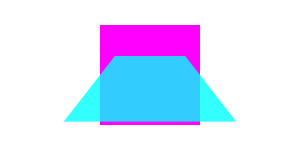

Perspective transforms
======================
**Status**: explainer.

Allow for perspective (non-affine) 2D transforms. Non-affine transforms are
transformations where parallel lines don't remain parallel after the transform.


Rationale
---------

Non-affine/perspective transforms are supported on all major 2D APIs (either directly or throught filters). For flat fill, it can be replaced by regular paths. Unfortunately, this doesn't work for drawImages, where non-affine transform need to be applied to the render.

The use cases include effects rendering images with flipping and perspective effects.

Proposal
--------

```webidl
interface mixin CanvasTransform {
  // Already exists:
  [NewObject] DOMMatrix getTransform();
  void resetTransform();

  void transform(unrestricted double a, unrestricted double b, unrestricted double c, unrestricted double d, unrestricted double e, unrestricted double f);
  void setTransform(unrestricted double a, unrestricted double b, unrestricted double c, unrestricted double d, unrestricted double e, unrestricted double f);

  // updates:
  void scale(unrestricted double x, unrestricted double y, optional unrestricted double z);
  void translate(unrestricted double x, unrestricted double y, optional unrestricted double z);
  void rotate3d(unrestricted double angleZ, optional unrestricted double angleY, optional unrestricted dobule angleX);
  void rotateAxis(unrestricted double axisX, unrestricted double axisY, unrestricted double axisZ, unrestricted double angle);
  void perspective(unrestricted double length);

  void setTransform(optional DOMMatrixInit transform = {});
  void transform(DOMMatrixInit transform);
};
```

We now allow a full 4x4 Matrix as the state of a Canvas transform. We also create
a new `transform()` function that multiplies the current matrix by the passed
parameter.

Finally, we support `scale`/`translate`/`rotate` with extra optional parameters.


### Open issues and questions

* do we need to specify non-affine perspective texture transforms for drawImage?
* support pre-multiply for transform?

Example usage
-------------

```js
  // Javascript example, draws a trapezoid
  const canvas = document.createElement('canvas');
  const ctx = canvas.getContext('2d');

  const w = canvas.width;
  const h = canvas.height;
  ctx.fillStyle = "magenta";
  ctx.fillRect(w/2 - 50, h/2 - 50, 100, 100);
  ctx.fillStyle = "rgba(0, 2550, 255, 0.8)";
  ctx.translate(w/2, h/2);
  ctx.perspective(100);
  ctx.rotate3d(1.0, 0, 0);
  ctx.translate(-w/2, -h/2);
  ctx.fillRect(w/2 - 50, h/2 - 50, 100, 100);
```

The above code will produce the the following canvas:



References
----------

- https://drafts.csswg.org/css-transforms-2
- https://drafts.fxtf.org/geometry/#DOMMatrix
