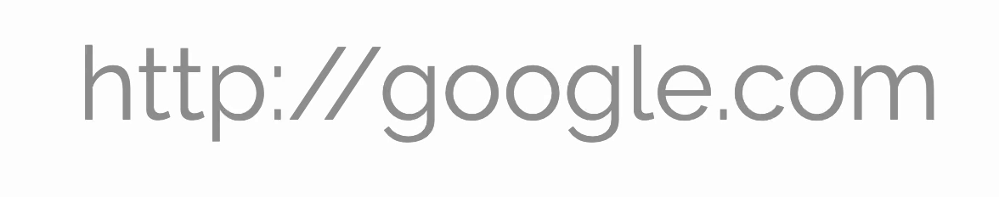
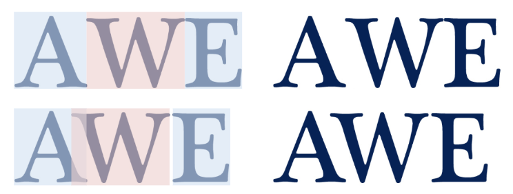

# WebText

**Status**: explainer

## Rationale
The 2D canvas exposes limited layout information – text can be measured and
rendered as a single line only, optionally, compressed to fit within a certain
width. If developers want to display a paragraph of text (ex: usage for Google
doc), developers need to manage the exact (x, y) location for the start of each
line and manage the line break at the end of the line. Layout needs to be
recalculated after each insertion and deletion. This makes the rendering of the
paragraphs very hard with canvas.

The 2D canvas offers limited text placement information (via measureText), so
apps that require accurate cursor placement in text with kerning and ligatures
are impossible to be implemented perfectly. For example, kerning on the "/"
character results inaccurate cursor placement over the word "google":


*<center>wrong cursor placement in google</center>*
## Use Case
1. Use case: multiple line text placement (P0)  
   Given a text element with desired styles applied, Canvas can generate a
   multi-line paragraph with a reference coordinate (x, y) and a given width.

   Note: Its users’ responsibility to ensure rendered text is properly
   constrained to fit in the space provided by adjusting font-size, line width,
   line-spacing, etc., on the input text objects.

1. Use Case: grapheme info (P0)  
   Cursor placement: Users are able to place the cursor precisely after each
   grapheme (solving the Google.com example above).

   Selection placement: Similarly, when users select a block of text, the
   bounding box is placed correctly.

   Highlight placement: Users are able to implement text highlighting for a
   specific block of text in the layout  (example: search for a phrase in the
   paragraph)

1. Use Case: customized per-line lengths (P1)  
   Users can specify the constraints per-line, such as line width, line spacing.
   This is useful to render images that flow with the text. (example)

1. Use Case: text style edit (P2)  
   Text addition and deletion: Users can add or remove grapheme at the start,
   middle or end of the paragraph (layout).

   Edit paragraph style (example style: font): Users can select text in a
   paragraph and change its style. The change of layout of the paragraph should
   not cause any change in text styles.

   Move: Users can select some text and move it to a different place in the
   paragraph, where the moved text keeps its original style.

   Click: If a point on the layout is clicked, the API allows the users to find
   which grapheme was clicked.

   Multiple paragraph changes: Users can select one or more lines from one or
   more span or div and change the style (font, size, color, highlight, underline,
   etc).

   Link: Users can make a selection of text and add a link to it, and follow the
   link if the bounding box of the text is clicked.


## Background
### Terminology:  
**Glyph**: A glyph is a specific shape, design, or representation of a
character, which stored as an image in a font. More than one glyph may be used
to draw a single symbol – for example, the symbol “é” may be drawn by combining
the glyph “e” with the glyph “´”. 

**Code points** (UTF-16): Code points are the atomic parts of Unicode text. Most
of them fit into one JavaScript character (ex: letter ‘A’), some of them occupy
two (ex: emojis). The latter is because they are not in the basic multilingual
plane of Unicode, so they take more than one 16 bits to encode. UTF-16 handles
this by using surrogate pairs, that is, two 16-bit code units that can be
combined to get a higher value Unicode code point. (ex: 🙂 \ud83d \ude42)

```javascript
'🙂'.length => 2
'🙂'.charCodeAt(0).toString(16) => 'd83d'
'🙂'.charCodeAt(1).toString(16) => 'de42'
```

**Grapheme cluster** (user-perceived characters): represent the written symbols,
as displayed on screen or paper. They are the smallest unit of the writing
symbol, visually. Ex: for languages like English, the term Grapheme, letter
and glyph are interchangeable. For emojis, each emoji is a grapheme cluster.
Sometimes, one or more code points are needed to encode a single grapheme
cluster (see below).

| Grapheme | A | 👨‍👩‍👧 | क्षि |
|----------|---|----|----|
| Code point | U+0041 | U+1F468, U+200D, U+1F469, U+200D, U+1F467| U+0915, U+094D, U+0937, U+093F |
| Meaning | A | family: man, woman, girl | क,  ् ,  ष ,  ि

Users are expected to see cursors move by one grapheme cluster at a time,
selections start and end at grapheme cluster boundaries, and pressing backspace
once deletes the last grapheme cluster even if it took several keystrokes to
enter (eg, À takes A and the accent, users don’t expect to see accent get delete
and A remains after pressing backspace).

With combinations, Grapheme clusters could exceed the line height, considering
the following extreme example, 5 grapheme clusters(Z, A, L, G, O) with 58
javascript coding.


Z͑ͫ̓ͪ̂ͫ̽͏̴̙̤̞͉͚̯̞̠͍A̴̵̜̰͔ͫ͗͢L̠ͨͧͩ͘G̴̻͈͍͔̹̑͗̎̅͛́Ǫ̵̹̻̝̳͂̌̌͘

## Kerning
Kerning is a typographic technique used to create visually appealing and
readable text by adjusting the space between certain letter pairs. In the
example below, without kerning, blindly applying the same letter spacing for
the letters "AW"  leaves an ambiguously large space, and with the same
spacing “WE” leaves crowds W and E. Correcting this requires adjusting the
placement of each character, overlapping or spreading out their bounding
regions depending on the context of adjacent characters.


*<center>AWE in kerning</center>*

In canvas, the metrics including width are available for individual letters or
words, but no information available for layout after kerning applied. This is
the main cause of the wrong cursor position in the example http://google.com
above.
