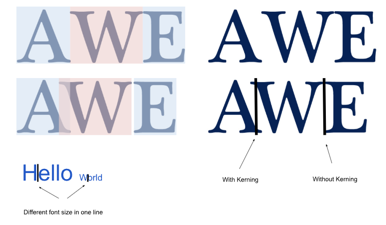
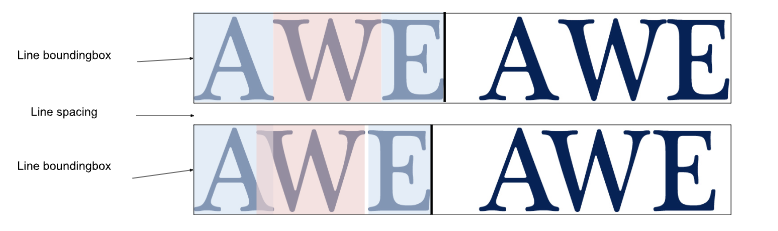

# WebText - Metrics

**Status**: explainer

Metrics for the text element, so that users are able to place the cursor
precisely after each grapheme cluster (this solves the Google.com example
above). Note that I use grapheme instead of grapheme cluster in the code
for simplicity.

## Proposal
``` javascript
//Properties for text element: (for text in the same span)
start_location; // (x, y)
lines[]; // line iterator
line_spacing; // the space between 2 lines
getPosition(grapheme, index); // something that takes the index and find the position of the next grapheme matches the given one
getGraphemeAtPoint(x,y) // returns the grapheme object occurs at (x, y). If (x, y) is in between 2 grapheme boxes, then return the one after it.
getGrapheme(index) // return the grapheme object at the given index.
getSetting() // the settings used for this span, font, font-weight, font-size, textAlignment, etc. 
getIndex(Grapheme) // return the index of the given grapheme 

// Properties for line object:
start_location; // (x, y)
bounding_box; // The boundry box for the line object
graphme_iter; // grapheme iterator.
next(); // returns the line object after this line (line below for text written in horizaontal direction).
previous(); // returns the line object before this line (line above for text written in horizaontal direction).
getGraphemeAtPosition(x, y); // return graphame at position (x, y). If (x, y) is between 2 graphemes (ex: the overlap area in the kerning example) return the first grapheme.
getGraphemePosition(textValue, int index); // the return the position of the first grapheme matches the text value after index.
getLineNumber() // return an int represent the line number in the text.

// Properties for grapheme object:
start_location; // (x, y)
bounding_box; // The boundry box of grapheme
getCodePoints(); // Returns the inner text of the grapheme, a single letter for english
next(); // returns the grapheme object before this grapheme (left one in the ltr text).
previous(); // returns the grapheme object after this grapheme (right one in the ltr text)
isEmoji(); // returns a boolean value specifies if the grapheme is an emoji
length(); // returns the number of code points in this grapheme. क्षि in the example above would return 4,  क,  ् ,  ष , ि
getSetting() // inherit the setting from text. 
line* line // a reference to the line object

// Genereal API:
// the existing textmetrics object should be available in the new API as well.
measureText(grapheme[]) // returns the text metrics object for the list of graphemes. 
```

*Developer notes: the property list above doesn’t need to be built for the entire text object. After receiving a request for location (x, y), we can use measureText() or some other functions to estimate which line we need to build the grapheme property map.*  

*Developer notes: Split grapheme from glyphs is needed in many different
scenarios. Some programming languages offer options to split by grapheme
cluster, like [swift](https://docs.swift.org/swift-book/documentation/the-swift-programming-language/stringsandcharacters/);
and some standalone tools exist as well. I found this implementation on
github to split graphemes for a set of glyphs.
[Grapheme splitter](https://github.com/orling/grapheme-splitter/tree/master)*

### Usage example
#### Grapheme
``` javacript
const g = document.createElement("div");
g.innerText = "Hello 👪, क्षि";

// properties for 'h'
start_location: (0,10)
bounding_box: 0, 10, 10x10
getTextValue() -> h
next(); -> grapheme object for 'e'
previous(); -> null
isEmoji(); -> false
length(); -> 1
line: line("Hello 👪, क्षि")
getSetting() -> default setting, ariel, font 10px, ... 

// properties for '👪'
start_location: (60,10)
bounding_box: 60, 10, 10x10
getTextValue() -> \u1f46a, \u0dc6a
next(); -> grapheme object for ','
previous(); -> grapheme object for ' '
isEmoji(); -> true
length(); -> 2
line: line("Hello 👪, क्षि")
getSetting() -> default setting, ariel, font 10px, ... 

// properties for 'क्षि'
start_location: (90,10)
bounding_box: 90, 10, 10x10
getTextValue() -> क ् ष ि
next(); -> grapheme object for ' '
previous(); -> null
isEmoji(); -> false
length(); -> 4
line: line("Hello 👪, क्षि")
getSetting() -> default setting, ariel, font 10px, ... 
```
#### Line
``` javascript
const g = document.createElement("div");
g.innerText = "Hello 👪, क्षि";

start_location: (0, 10);
bounding_box:(0, 10, 100x10); 
previous() -> null;
next() -> null;
graphme[] = grapheme('H') // points to H to start the interation;
getGraphemeAtPosition(x, y); // getGraphemeAtPosition(15, 5): return e (as a grapheme object)
getGraphemePosition(textValue, int index); // getGraphemePosition('l', 3): return l (the grapheme object for second l).
getLineNumber(): 0
```

### Cursor Position
A cursor is a reference to an inter-grapheme cluster point. Horizontally, the
cursor position always aligns with the x coordinate for the end of the previous
grapheme cluster; and vertically, the cursor position aligns with the height of
the font bounding box of the grapheme before it (as shown in the image below,
the cursor height changes when it moves from ‘Hello’ to ‘world’). For kerning
cases, horizontally, the cursor position is in the middle of the overlapped
area, i.e., if one grapheme’s bounding box ends at x = a horizontally and one’s
bounding box starts on x = b horizontally, then the cursor is at (a + b)/2 (as
shown in the picture below, the cursor between ‘A’ and ‘W’.)


*<center>Cursor Position</center>*

When the cursor moves, it should follow the following rules: Cursor moves
horizontally (right or left) by the width of the next grapheme cluster; and
moves vertically (up or down) by the height of the lines + line spacing
between the two lines.


*<center>Vertical for cursor</center>*

The following are examples of how web developers could use our API to solve the
use cases we have above:

``` javascript
// Cursor properties:
Corsor{
x; // x position
y; // y position
height; // height of the cursor
width; // width of the cursor
Grapheme grapheme_before;
Grapheme grapheme_after;
}


const g = document.createElement("div");
g.innerText = "Hello 👪, क्षि";

// find cusor position when randomly click on the screen. 
// assuming cursor is clicked at position (35, 5):
function getCursorAtPosition(x, y) {
  current_grapheme = getGraphemeAtPoint(x, y); // with (35, 5), it should return 'l'
  next_grapheme = current_grapheme.next(); // with (35, 5), it should be 'o'
  // find the horizontal cursor position
  cursor_x = (current_grapheme.x + current_grapheme.width + next_grapheme.x)/2;
  // find the vertical cursor position
  cursor_y = measureText(current_grapheme).fontBoundingBoxAscent + measureText(current_grapheme).fontBoundingBoxDescent;
  return Cursor(cursor_x, cursor_y);
}

function moveRight(cursor) {
  current_grapheme = getGraphemeAtPoint(cursor.x, cursor.x);
  next_grapheme = current_grapheme.next();
  return getCursorAtPosition(next_grapheme.x, next_grapheme.y);
}

function moveDown(cursor) {
  current_grapheme = getGraphemeAtPoint(cursor.x, cursor.x);
  location_x = cursor.x;
  location_y = current_grapheme.line.next().start_location.y;
  return getCursorAtPosition(location_x, location_y);
}
```
#### Insertion and deletion at cursor point
Users also need to make simple edits on the text element. Note that users are
responsible for re-layout after the edits. 
```
const g = document.createElement("div");
g.innerText = "Hello 👪, क्षि";

// assument cursor moved to between ' ' and '👪'. Users want to insert family
index = getIndex('👪');
text = g.innerText;
let newText = text.slice(0, index) + 'family' + text.slice(index);
g.innerText = newText;
```

### Selection
A selection contains two cursors, start and end, which can be used to modify
text. Selections may contain text from different spans or divs. Implementations
can create, break, or merge spans as appropriate.

## Further
- Indexability
- Accessibility
- Vertical text metrics

## Further reading
- [Text Rendering Hates You](https://faultlore.com/blah/text-hates-you/)  
- [Adventures in Text Rendering: Kerning and Glyph Atlases | Warp](https://www.warp.dev/blog/adventures-text-rendering-kerning-glyph-atlases)  
- [Breaking paragraphs into lines](http://www.eprg.org/G53DOC/pdfs/knuth-plass-breaking.pdf)  
- [Swift - String and Characters](https://docs.swift.org/swift-book/documentation/the-swift-programming-language/stringsandcharacters/)  
- [Poposal intl segmenter](https://docs.swift.org/swift-book/documentation/the-swift-programming-language/stringsandcharacters/)
- [Javascript: Strings](https://exploringjs.com/impatient-js/ch_strings.html)  
- [W3C: Text-Processing](https://www.w3.org/TR/international-specs/#char_indexing)  
- [Unicode Text Segmentation](https://www.unicode.org/reports/tr29/)
- [Browser Rendering pipeline](https://webperf.tips/tip/browser-rendering-pipeline/)